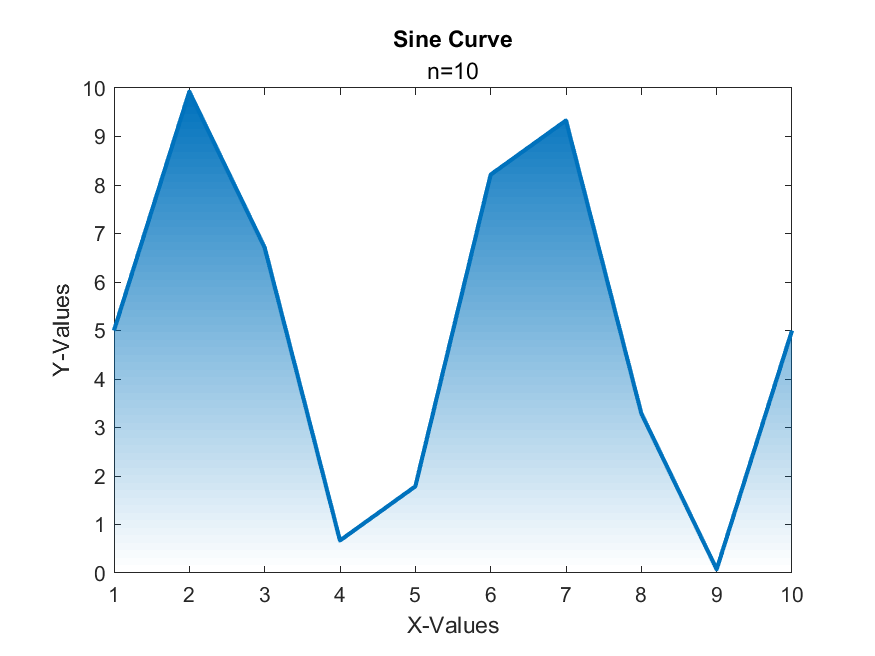
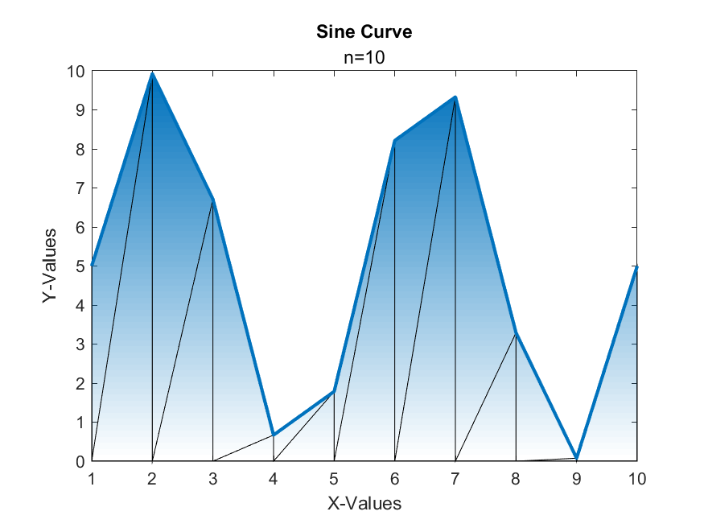

# Filled Line Chart

[](https://www.mathworks.com/matlabcentral/fileexchange/117080-filled-line-chart)

Version: 1.0

Plots a line chart with a filled gradient using explicit triangulation for optimization.





## Syntax
Rather than depending on patch's algorithm to triangulize the object for rendering, it is more efficient and scalable to explicitly provide it. See the `performanceTest.m` file for more info.

- `filledLineChart(XData, YData)` - creates one or more lines each with their own gradient using an optimized algorithm. Each column of YData represents a new line.
- `filledLineChart(_, Name, Value)` - specifies additional options for the chart using one or more name-value pair arguments. Specify the options after all other input arguments.
- `filledLineChart(target, _)` - plots into target instead of GCF.
- `f = filledLineChart(_)` - returns the filledLineChart object. Use `f` to modify properties of the chart after creating it.

This information is also available if you call `help filledLineChart`.

## Name-Value Pair Arguments/Properties
- `XData` (n x 1 numeric vector) - the x-coordinates of the line, not including NaNs.
- `YData` (n x m numeric non-negative vector) - the y-coordinates of the line, not including NaNs. Each column is assumed to be a new line representing `m` different lines, each assuming to share the same `n` x-coordinates.
- `Title` (1 x n char vector) - the title of the chart.
- `Subtitle` (1 x n char vector) - the subtitle of the chart.
- `XLabel` (1 x n char vector) - the label of the x-axis.
- `YLabel` (1 x n char vector) - the label of the y-axis.
- `ColorOrder` (n x 3 RGB triplets)- the color order used for the patch and line objects. Each line and its gradient will have the same color based on the color order.
- `Grid` (`'on', 'off', 'rows', or 'columns'`) - specifies which major gridlines are visible.
- `LineWidth` (double) - the width of the line. Note that if there are multiple lines, this property will apply to all of them.
- `LineStyle` (`'-', '--', ':', or '-.'`) - the style of the line. Note that if there are multiple lines, this property will apply to all of them.
- `LegendVisible` (scalar `matlab.lang.OnOffSwitchState`) - specifies whether to have a legend or not.
- `LegendLabels` (1 x m char vector) - the labels of the legend for each line. Note if `LegendVisible` is not on, then the labels will not appear.
- `Optimized` (scalar `matlab.lang.OnOffSwitchState`) - specifies whether to use the optimized algorithm (with triangulation) or the unoptimized one (drawing out the line and the area underneath it).
- `ShowTriangulation` (scalar `matlab.lang.OnOffSwitchState`) - species whether to show the explicit triangulation by setting the edge color of the patch object to black. If the chart was plotted using the unoptimized algorithm, no triangulation was used so it will not appear, even if this property is on.


## Example
Open the `example.mlx` file to view more examples.

Graph a sine curve with a filled gradient.
```
n = 10;
x = 1:n;
y = 5*sin(linspace(0,4*pi,n)) + 5;

f = filledLineChart(x,y);

f.Title = "Sine Curve";
f.Subtitle = "n=10";
f.XLabel = "X-Values";
f.YLabel = "Y-Values";
f.LineStyle = '--';
```

Display the triangulation using the `ShowTriangulation` property.
```
f.ShowTriangulation = 'on';
```

To plot multiple lines, a sine and cosine curve, provide the new YData as two columns.
```
n = 100;
x = 1:n;
y = 5*sin(linspace(0,4*pi,n)) + 5;
y2 = 5*cos(linspace(0,4*pi,n)) + 5;

g = filledLineChart(x,[y' y2'], 'LegendVisible', true, 'LegendLabels', ["sin(x)" "cos(x)"]);

g.Title = "Sine and Cosine Curve";
g.Subtitle = "n=100";
g.XLabel = "X-Values";
g.YLabel = "Y-Values";
```


